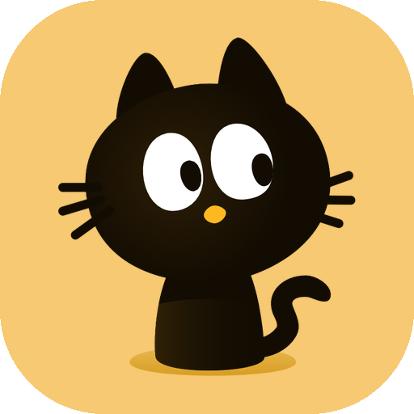
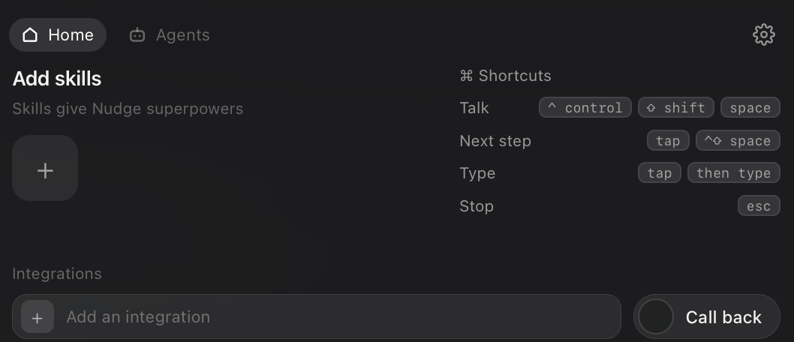

<div align="center">



# Nudge

**A small agent that lives in your notch and does things on your screen.**

Hold a key. Say what you want. It reads what you are looking at, finds the
control, and clicks it — or takes the whole task away and finishes it.

[](https://nudge.runmycrew.com)
[](https://nudge.runmycrew.com)
[](https://nudge.runmycrew.com)
[](https://github.com/bibektimilsina00/nudge/actions/workflows/ci.yml)
[](https://tauri.app)

[**Download**](https://nudge.runmycrew.com) · [Build from source](#build-it-yourself) · [How it works](#how-it-works) · [Report a bug](https://github.com/bibektimilsina00/nudge/issues)

</div>

---

## The idea

Every AI assistant right now is the same shape: a text box. You describe what you
are looking at to something that cannot see it, it describes back what you should
click, and you go and click it yourself.

Nudge is on your side of the screen. It sees what you see, and it has hands.

| You say | It does |
|---|---|
| *"What is this error actually telling me?"* | Reads the dialog in front of you and answers in plain language |
| *"Where is the setting for scaling in this app?"* | Finds the buried menu item and points at it, so you learn where it was |
| *"Play something by Radiohead on YouTube."* | Opens the browser, searches, picks a result, presses play |
| *"Fill this form in with the details from that email."* | Reads one window, types into another, field by field |
| *"Teach me DaVinci Resolve."* | Draws on your screen and walks you through it, one chapter at a time |

No window. No dock icon. No chat history to scroll — just a cat in the dead space
at the top of the display.

<div align="center">

</div>

## Install

**Download the build** — [nudge.runmycrew.com](https://nudge.runmycrew.com) serves
signed, notarised `.dmg` for Apple Silicon and `.deb` / AppImage for Linux. It
updates itself after that.

On first use Nudge asks for **Screen Recording** and **Microphone**. Grant both and
relaunch — macOS does not hand a new grant to a process that is already running.

No API key? Sign in and turns go through our proxy. Prefer your own? Paste a Gemini
or Anthropic key in Settings, or run a local model and pay nobody:

```sh
brew install ollama && ollama pull qwen3-vl:4b   # then set provider = "ollama"
```

## Using it

| Key | What happens |
|---|---|
| **Hold** `ctrl` `alt` | Talk. Release and it answers |
| **Tap** the same keys | Type instead, or skip to the next step |
| **Draw** while you talk | Circle anything on screen — it sees the drawing |
| `esc` | Stops it. Whatever it was in the middle of |

A ring appears over the control to click and stays there until you actually click
it, then the next step loads by itself. Turn on **Click for me** and it does the
clicking too.

## How it works

Each turn is a fresh capture, because step 2's target usually lives inside a menu
step 1 opened — it is in no earlier screenshot. The model is asked what to do next
and answers with exactly one of 31 outcomes:

```
Point · Launch · Open · Type · Press · Tour · Done · Unsure
Run · Write · Read · Edit · Fetch · Search · Task · Agent · Question · …
```

Each exists because collapsing it into another one caused a visible bug. `Unsure`
is there because a model that may only point or finish will **invent coordinates**
when shown a screen with no matching control. `Question` is what makes an
unattended agent able to ask *"which Sara?"* instead of guessing.

**Three things run underneath the loop:**

- **Grounding** — on macOS the accessibility tree gives exact bounds for free;
  everywhere else, and inside Blender, DAWs and CAD where the whole window is one
  GPU canvas, the vision model is the universal path.
- **A context budget** — `core/context.rs` decides room for every section of the
  prompt first, then cuts each exactly once. A plain question used to ship 52,221
  characters of prompt and now ships about 22,000.
- **An agent runtime** — `core/run/agent.rs` drives itself with a step budget,
  a visible stop, and a question it can ask you. While it runs it owns the real
  cursor, which is what "do it for me" means.

## What it will not do

- **Secrets stay in the Keychain.** `connections.toml` only ever *names* one, as
  `keychain:<item>`. Nothing is pasted into a file or a commit.
- **It refuses to look at password managers.** `core/screen/privacy.rs`, mid-agent
  as well as before one starts.
- **Counts, never content.** The analytics send how long a turn took and which
  model answered. Never a goal, a transcript, a window title, an application name
  or a path — and the switch in Settings is off in one click. See
  [`core/counted.rs`](src-tauri/src/core/counted.rs).
- **Launching is validated as untrusted input.** The app name comes from a language
  model, so paths, flags, shell metacharacters and URLs are all refused, with a
  test for each.

## Layout

```
src-tauri/src/
  core/                 What Nudge does. No Tauri. Unit-testable.
    provider/           gemini · anthropic · ollama, behind one trait
    run/                session · agent · subagent — the loops
    screen/             capture · ax · click · keyboard · ink · privacy
    tools/              mcp · shell · files · fetch · relevant
    voice/              ear · record · transcribe · speech
    context.rs          the prompt budget          teaching.rs   tour scoring
    memory.rs           what it remembers          threads.rs    conversations
    counted.rs          what it reports            laps.rs       where time goes
  app/                  Wiring core to the OS. Thin by design.
    ui/ · input/ · commands/ · agent.rs · tour.rs · update.rs
  bin/                  errand · bench · picks · truth · probe · judge · ax
tests/layering.rs       Fails the build if core imports Tauri

ui/                     The panel and overlay. React, Tailwind v4, Vite.
server/                 FastAPI: releases, accounts, model proxy, counts.
web/                    The marketing site. Next.js.
```

**The one architectural rule:** `core` must not know Tauri exists. That is what
lets 494 tests run without a window server, and it is checked rather than trusted —
a documented boundary decays the first time somebody wants an `AppHandle` inside a
provider.

## Build it yourself

```sh
make tools                                           # one time
cp config.example.toml ~/.config/nudge/config.toml
make pin-identity ID="Apple Development: ..."        # macOS only — see below
make run                                             # build, sign, restart
```

```sh
make dev          # hot reload
make test         # 494 Rust tests
make lint         # clippy -D warnings, then fmt --check
make timings      # where turns have been spending their time
make bench        # the accuracy number
```

`make` on its own lists every target.

> **Code signing is not optional on macOS, even in development.** TCC identifies an
> app by its signature, so an ad-hoc build gets a fresh identity every time and your
> Screen Recording grant silently stops applying — while the toggle still reads
> "on". `.signing-identity` pins the certificate. See [RELEASING.md](RELEASING.md).

**Linux** is X11 only. Injecting input and reading a held modifier are things
Wayland deliberately forbids; on Wayland the window appears and the hotkey never
fires.

## Proving it works

The whole product rested on one question: *can a model return the on-screen
position of a named control accurately enough to draw a ring around it?* That is
measured, not assumed:

```sh
make probe GOAL="open the UV editor"     # writes a PNG with the ring drawn on
make bench                               # scores every saved case
make timings                             # p50 per stage, per turn
```

Nearly every fix in this repository came out of one of those rather than out of
reading the code. Spoken turns got roughly twice as fast when measurement showed
the on-device transcriber was being abandoned after one cold-start timeout. Tour
scoring promptly revealed that the sloppy boxes were mine, not the model's.

## The documents

Every document in this repository and what it is for. If a document is not on this
list it should not exist.

| | |
|---|---|
| [CLAUDE.md](CLAUDE.md) | Conventions, and the things that have bitten |
| [PLAN.md](PLAN.md) | What is being built next, and why |
| [FEATURES.md](FEATURES.md) | Every feature between here and "gets your everyday tasks done" |
| [FINDINGS.md](FINDINGS.md) | What the accuracy and truth suites actually measured |
| [SPEED.md](SPEED.md) | Where the seconds go |
| [RELEASING.md](RELEASING.md) | Signing and notarising. Read before cutting a tag |
| [DEPLOY.md](DEPLOY.md) | The site, the API, and how they ship |
| [PORTING.md](PORTING.md) | Which calls to suspect first on another platform |
| [OPENWORKER.md](OPENWORKER.md) · [OPENEXECUTIVE.md](OPENEXECUTIVE.md) | Readings that shaped the plan |
| [truth/README.md](truth/README.md) · [picks/README.md](picks/README.md) | The two scoring suites |

## Status

**Early, and honest about it.** It works, it is genuinely useful, and it will also
do things confidently and wrongly. 397 commits, 10 releases.

Not built yet, deliberately:

- **Concurrent agents** — two agents fighting over one cursor is incoherent
- **Wayland** — needs the RemoteDesktop portal and libei, which is its own project
- **Windows** — reachable through Tauri; the screen and input layers are the work

If you want to break it, that is the most useful thing anyone can do right now.
There is a **Report a bug** button inside the app, or
[open an issue](https://github.com/bibektimilsina00/nudge/issues) — what you asked
it to do and what it did instead is the good stuff.

<div align="center">
<br />
<sub>Built with Rust, Tauri and too many evenings.</sub>
</div>
